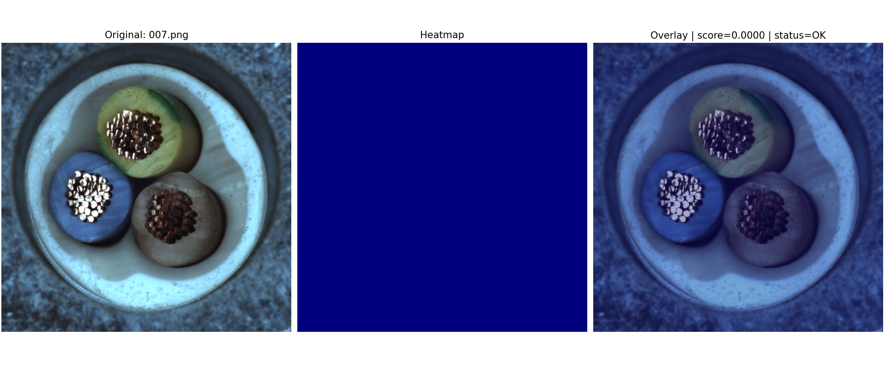
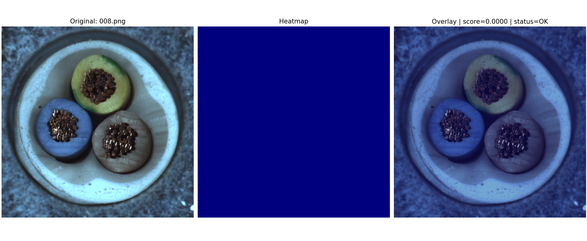
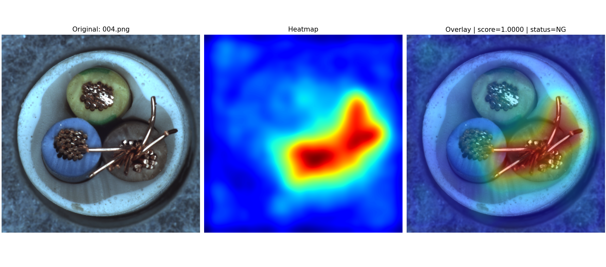
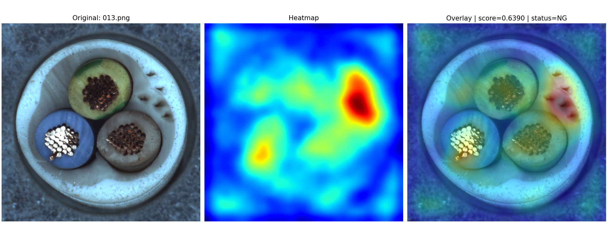

# Visual Anomaly Detection with PatchCore

This project demonstrates a visual anomaly detection system for industrial inspection using PatchCore with Anomalib on the MVTec AD Cable dataset.

The system performs image-level OK/NG classification and pixel-level anomaly localization. Each test image is assigned an anomaly score, classified using a threshold-based decision rule, and visualized with an anomaly heatmap to show suspicious regions on the workpiece.

---

## Demo

YouTube Demo: [Watch the demo](https://www.youtube.com/watch?v=WkkjC8QWbuI)

---

## Objective

The objective of this project is to study how AI-based anomaly detection can be applied to industrial visual inspection, especially for:

- OK/NG classification
- Anomaly localization
- Threshold-based inspection decision
- Heatmap visualization for defect interpretation

---

## Dataset

- Dataset: MVTec AD
- Category: Cable
- Task: Visual anomaly detection and localization

The MVTec AD dataset is not included in this repository.  
Please download the dataset separately and update the dataset path before training or inference.

---

## Model Configuration

- Method: PatchCore
- Framework: Anomalib
- Backbone: Wide ResNet-50-2
- Feature extraction layers: layer2, layer3
- Coreset sampling ratio: 1.0
- Number of nearest neighbors: 9

Configuration reference:

```text
configs/patchcore_config.yaml
```

---

## Results

The following results were obtained from the project evaluation on the MVTec AD Cable dataset:

| Metric | Result |
|---|---:|
| Image AUROC | 99% |
| Image F1-score | 97% |
| Pixel AUROC | 98% |
| Pixel F1-score | 64% |

These results represent the project evaluation results on the MVTec AD Cable category and may vary depending on environment, threshold settings, preprocessing, and training configuration.

---

## OK/NG Classification

For demonstration, an anomaly score threshold of `0.5` was used to classify each test image.

| Condition | Prediction |
|---|---|
| Anomaly score < 0.50 | OK |
| Anomaly score >= 0.50 | NG |

The threshold can be adjusted depending on the inspection requirement. A lower threshold increases sensitivity to defects but may also increase false positives. A higher threshold reduces false positives but may miss subtle defects.

---

## Visualization Output

For each test image, the system generates visualization output showing:

1. Original image
2. Anomaly heatmap
3. Heatmap overlay on the original image

These outputs help show not only whether a sample is classified as OK or NG, but also where the model identifies abnormal regions on the workpiece.

---

## Example Outputs

### OK Samples





### NG Samples





---

## Repository Structure

```text
visual_anomaly_detection/
├── configs/
│   └── patchcore_config.yaml
│
├── docs/
│   ├── images/
│   │   ├── ng_sample_result_1.png
│   │   ├── ng_sample_result_2.png
│   │   ├── ok_sample_result_1.png
│   │   └── ok_sample_result_2.png
│   ├── inference.md
│   ├── training.md
│   └── results.md
│
├── inference/
│   └── inference.py
│
├── models/
│   └── README.md
│
├── training/
│   └── patchcore_training.py
│
├── .gitignore
├── README.md
└── requirements.txt
```

---

## Main Components

| Path | Purpose |
|---|---|
| `configs/patchcore_config.yaml` | Placeholder configuration for dataset, model, training, and inference settings |
| `training/patchcore_training.py` | PatchCore training script using Anomalib |
| `inference/inference.py` | PatchCore inference and visualization script |
| `docs/training.md` | Training workflow documentation |
| `docs/inference.md` | Inference workflow documentation |
| `docs/results.md` | Evaluation results and notes |
| `models/README.md` | Checkpoint file instructions |
| `requirements.txt` | Python-level package requirements |

---

## How to Run

### 1. Install dependencies

```bash
pip install -r requirements.txt
```

For CUDA support, install PyTorch according to your CUDA version from the official PyTorch installation guide.

---

### 2. Prepare the dataset

Download the MVTec AD dataset and place the Cable category in your dataset directory.

Example dataset structure:

```text
path/to/mvtec_ad/
└── cable/
    ├── train/
    ├── test/
    └── ground_truth/
```

The dataset is not included in this repository.

---

### 3. Train the PatchCore model

Run training with placeholder/default arguments:

```bash
python training/patchcore_training.py
```

Run training with custom paths:

```bash
python training/patchcore_training.py --data-root path/to/mvtec_ad --category cable --output-dir path/to/results
```

The training script saves outputs such as checkpoints and result files under the output directory.

---

### 4. Prepare the checkpoint for inference

After training, use the generated checkpoint file for inference.

Example placeholder checkpoint path:

```text
path/to/model.ckpt
```

Model checkpoint files are not committed to this repository due to file size and environment-specific output paths.

---

### 5. Run inference

Run inference with placeholder/default arguments:

```bash
python inference/inference.py
```

Run inference with custom paths:

```bash
python inference/inference.py --ckpt path/to/model.ckpt --input path/to/input_image_or_folder --output-dir path/to/output_dir --threshold 0.5
```

The inference script classifies test images as OK or NG and generates visualization outputs including the original image, anomaly heatmap, and heatmap overlay.

---

## Documentation

More detailed documentation is available in the `docs/` directory:

- [Training Guide](docs/training.md)
- [Inference Guide](docs/inference.md)
- [Results](docs/results.md)

---

## Technologies Used

- Python
- PyTorch
- PatchCore
- Anomalib
- OpenCV
- NumPy
- Matplotlib
- MVTec AD Dataset
- Wide ResNet-50-2

---

## Key Learning

This project helped me understand the practical workflow of visual anomaly detection for industrial inspection, including the difference between image-level anomaly detection, pixel-level anomaly localization, threshold-based OK/NG classification, and visualization for defect interpretation.

---

## Notes

Model checkpoint files are not included in this repository due to file size.

The MVTec AD dataset is not included in this repository. Please download it from the official MVTec AD website.

Training outputs such as checkpoints, logs, and generated result folders are ignored by Git because they can be large and environment-specific.

The demo video is provided to show the actual inference and visualization workflow.